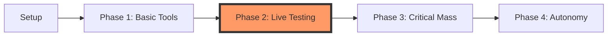

# AI Workflow Setup - Project Summary

> [!ABSTRACT] **Goal**
> Build a powerful local AI workflow using git from day one, enabling AI-assisted commits with verification, voice-based interaction with local models, and an Obsidian-based structured project system.

## 🗺️ Roadmap

## 🏗️ Architecture
- **Controller**: `agent/controller.py` - Planner -> Executor -> Verifier -> Git pipeline
- **Models**: Planner & Verifier (DeepSeek R1), Executor (Qwen3)
- **Visuals**: Obsidian Callouts + Mermaid (WOW factor)

---

## 🔗 Quick Links
- [[todo.md|✅ Todo List]]
- [[chat.log.md|💬 Chat History]]
- [[talk.md|🗣️ Talk to Agent]]

---

## ⚙️ Constraints
- Solo development
- Fully local execution (RTX 5090 / Ryzen 9800X3D)
- Agent restricted to writing only within `projects/` directory

